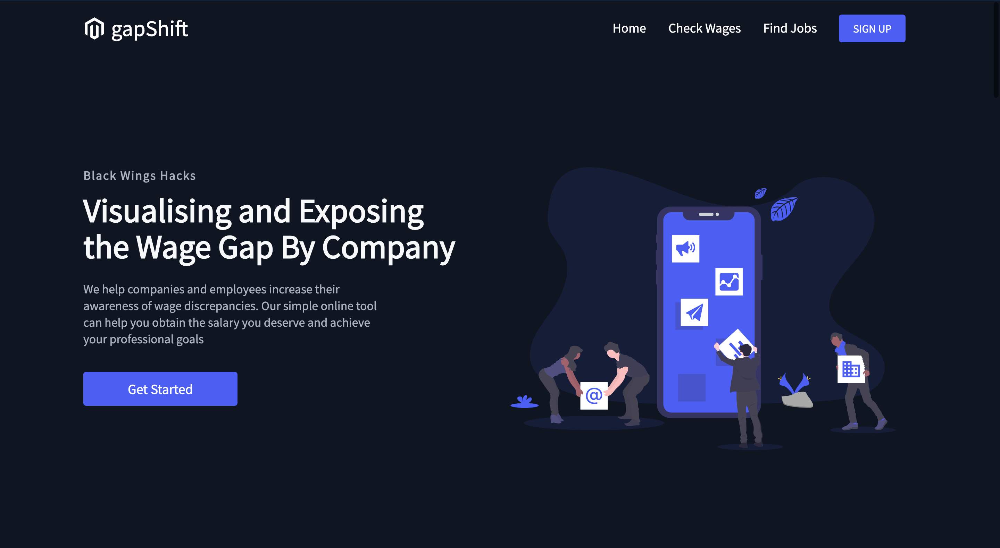

# Black_Wings_Hacks


## Inspiration
The gender wage gap still exists in the US (and beyond). According to Business Insider, on average a woman working full time in 2018 made 81.6 cents for every dollar a man working full time made. The wage gap is even wider when accounting for race; Black women make just 66% of what white men make and Hispanic women make just 58%. The pay gap is also more severe in certain locations.
https://www.businessinsider.com/gender-wage-pay-gap-charts-2017-3

## What it does
Our webapp combats the wage gap by providing salary info that takes into account demographic information as well as job title, location, level of experience, and company. People can come to the site to identify what companies and locations have balanced wages. Additionally, they can use the information from the site to help with negotiating their salary, especially if they see discrepancies that may be the result of demographic bias. Our users will be able to _pay it forward_ (pun intended) by anonymously reporting their salary, employment, and demographic info whenever they have a new job or promotion. 

## How we built it
The front end was built using React.js and the backend was built using python, Django, and CockroachDB.

## Challenges we ran into
Everyone on the team was new to CockroachDB so that took some getting used to. It was also challenging to connect the front end and back end.

## Accomplishments that we're proud of
We initiated the CockroachDB with sample data and set it up to receive future form input. The UI has a very inviting, clean look.

## What we learned
We learned how to use django dataframes with CockroachDB. 

## What's next for GapShift
We would like to import/scrape any existing databases that have salary information to include more data for our users. We will deploy the website and connect with individuals to grow the GapShift community. Many companies thrive off the taboo about discussing salary, but we are here to end that and make sure people are being paid according to their work ethic and talent.

## Domain names for GapShift:
ClosingTheGapIn.Tech

PayItForward.Online

KeepingItReal.Online


## For DEVELOPERS
#### Django with CockroachDB

The *cockroach_example* directory is set up to work with CockroachDB, organize user input data, and, when complete, run the gapShift web application.
Refer to _model.py_ in the _cockroach_directory_ for details on user input data. This framework is designed to have a home, about, and user page.
In order to run the web application, make sure to have the following installed: 

- psycopg2-binary
- django-cockroachdb

Once the installations are set, open the Cockroach demo database to retrieve your port number, initialize a database, and set your username/password by following steps 2 to 3 in the Cockroach Lab documentation - https://www.cockroachlabs.com/docs/stable/build-a-python-app-with-cockroachdb-django.html

Modify _settings.py_ in the _cockroach_example_ directory to match the port number and username/password generated in the previous steps.

Open a _new_ tab in your terminal, navigate to the _cockroach_example_ directory, and run the following commands: 

```
$python3 manage.py makemigrations cockroach_example
$python3 manage.py migrate
$python3 manage.py runserver
```

(Note: this is specified to python version 3)

The terminal will then output a link to the web page. 
Copy paste the link onto a browser to access the web page. 

You may copy paste the SQL commands from _example_data.sql_ in the _cockroach_example_ directory into the Cockroach demo (first terminal tab opened) to test the initialized cockroachDB database.
